<div align="center">


</div>

<div align="center">


</div>

---

<table align="center" border="0">
<tr>

<td width="35%" align="center" valign="middle">



</td>

<td width="65%" valign="middle">

###  Turning Ideas into Working Software

-  B.Tech Computer Science student at MVGR College of Engineering — GPA **8.49**, graduating **2027**
-  Focused on **Full Stack Development, Backend Systems, and REST APIs**
-  Building with **React, React Native, Node.js, Express.js, and Python**
-  Comfortable across **SQL, PostgreSQL, and MongoDB**
-  Exploring **Machine Learning** alongside core software engineering
-  Software Engineer Intern experience at **SmartBridge**
-  Always shipping, always learning

<br/>

>  *"Build it, ship it, learn from it."*

</td>

</tr>
</table>

<br/>

<p align="center">

</p>

---

##  Connect With Me

<div align="center">

[](https://bhargavprasad-portfolio.vercel.app/)
[](https://www.linkedin.com/in/vana-bhargav-prasad-57352b399/)
[](https://github.com/Bhargavprasad-data)
[](mailto:bhargavvana80@gmail.com)

</div>

---

##  Experience

<table align="center" border="0">
<tr>
<td width="100%">

**Software Engineer Intern** — SmartBridge
<br>
<sub>May 2025 – July 2025</sub>

Built **ShopSmart**, a digital grocery shopping platform:

- Developed user authentication and product management
- Built shopping cart and order processing functionality
- Integrated frontend and backend modules end to end
- Delivered a responsive, consistent user experience

`React.js` `Node.js` `Express.js` `MongoDB` `GitHub`

</td>
</tr>
</table>

---

##  Technical Skills

###  Languages
<div align="center">


</div>

###  Frontend
<div align="center">


</div>

###  Backend
<div align="center">


</div>

###  Mobile
<div align="center">


</div>

###  Databases
<div align="center">


</div>

###  Tools & Platforms
<div align="center">


</div>

---

##  Featured Projects

<table>
<tr>
<td width="50%" valign="top">

###  ClimateStock
AI-powered climate-based stock market prediction and analysis platform.

`Machine Learning` `Random Forest Classifier` `XGBoost Regressor`

[View Repository →](https://github.com/Bhargavprasad-data/ClimateStock)

</td>
<td width="50%" valign="top">

###  Jalrakshak — Water Guardian
IoT-based water management solution for monitoring rural water supply systems.

`React.js` `C++` `PostgreSQL`

[View Repository →](https://github.com/Bhargavprasad-data/Jalrakshak-water-guarden)

</td>
</tr>
<tr>
<td width="50%" valign="top">

###  Restaurant & Hotel Suite
Centralized hotel and restaurant management app — bookings, orders, staff, payments, and role-based dashboards.

`React Native` `Node.js` `PostgreSQL`

[View Repository →](https://github.com/Bhargavprasad-data/Restaurant-Hotel-Suite)

</td>
<td width="50%" valign="top">

###  College Timetable Management System
Centralized academic timetable management system.

`React.js` `Node.js` `PostgreSQL`

[View Repository →](https://github.com/Bhargavprasad-data/Timetable)

</td>
</tr>
</table>

---

##  Profile Views

<div align="center">


</div>

---

##  GitHub Stats

<div align="center">


</div>

---

##  GitHub Streak

<div align="center">


</div>

---

##  Contribution Snake

<div align="center">

<picture>
  <source media="(prefers-color-scheme: dark)" srcset="https://raw.githubusercontent.com/Bhargavprasad-data/Bhargavprasad-data/output/github-snake-dark.svg">
  <source media="(prefers-color-scheme: light)" srcset="https://raw.githubusercontent.com/Bhargavprasad-data/Bhargavprasad-data/output/github-snake.svg">
  
</picture>

</div>

---

##  Achievements

<div align="center">

 **Smart India Hackathon 2025** — Runner Up &nbsp;|&nbsp;  **HackerRank** — 3-Star Programmer

 HackerRank Problem Solving (Basic) &nbsp;|&nbsp;  HackerRank Python (Basic)

</div>

---

##  Core Computer Science

```text
Data Structures & Algorithms   Object-Oriented Programming
Database Management Systems    Operating Systems
Computer Networks              SQL
```

---

##  AI-Assisted Development

AI tools I use to support development, research, and productivity —
not a substitute for core engineering skills:

<div align="center">


</div>

---

###  Dev Quote of the Day

<div align="center">


</div>

---

##  Currently Learning

 Backend architecture & API design
<br/>
 Applied machine learning fundamentals
<br/>
 Shipping and refining personal full-stack projects

---

##  Contact

<div align="center">

[](https://bhargavprasad-portfolio.vercel.app/)
[](https://www.linkedin.com/in/vana-bhargav-prasad-57352b399/)
[](https://github.com/Bhargavprasad-data)
[](mailto:bhargavvana80@gmail.com)

</div>

<div align="center">


</div>
