<div align="center">


</div>

<div align="center">


</div>

<div align="center">


&nbsp;


</div>

---

<table align="center" border="0">
<tr>

<td width="35%" align="center" valign="middle">


</td>

<td width="65%" valign="middle">

###  &nbsp;Turning Ideas into Working Software

<br/>

-  &nbsp;B.Tech CS · MVGR College of Engineering · GPA **8.49** · Graduating **2027**
-  &nbsp;Focused on **Full Stack Development, Backend Systems & REST APIs**
-  &nbsp;Building with **React, React Native, Node.js, Express.js & Python**
-  &nbsp;Comfortable across **SQL, PostgreSQL & MongoDB**
-  &nbsp;Exploring **Machine Learning** alongside core software engineering
-  &nbsp;Software Engineer Intern @ **SmartBridge**
-  &nbsp;Always shipping, always learning

<br/>

>  &nbsp;*"Build it, ship it, learn from it."*

</td>

</tr>
</table>

<br/>

<p align="center">

</p>

---

##  &nbsp;Connect With Me

<div align="center">

[](https://bhargavprasad-portfolio.vercel.app/)
&nbsp;
[](https://www.linkedin.com/in/vana-bhargav-prasad-57352b399/)
&nbsp;
[](https://github.com/Bhargavprasad-data)
&nbsp;
[](mailto:bhargavvana80@gmail.com)

</div>

---

##  &nbsp;Experience

<div align="center">

<table border="0" width="80%">
<tr>
<td>

### 🏢 Software Engineer Intern — SmartBridge
<sub>📅 May 2025 – July 2025</sub>

<br/>

Built **ShopSmart** — a digital grocery shopping platform:

-  &nbsp;Developed user authentication and product management systems
-  &nbsp;Built shopping cart and order processing functionality end-to-end
-  &nbsp;Integrated frontend and backend modules seamlessly
-  &nbsp;Delivered a responsive, consistent user experience

<br/>


</td>
</tr>
</table>

</div>

---

##  &nbsp;Technical Skills

###  &nbsp;Languages

<div align="center">


&nbsp;

&nbsp;

&nbsp;

&nbsp;

&nbsp;


</div>

###  &nbsp;Frontend

<div align="center">


&nbsp;

&nbsp;


</div>

###  &nbsp;Backend

<div align="center">


&nbsp;


</div>

###  &nbsp;Mobile

<div align="center">


</div>

###  &nbsp;Databases

<div align="center">


&nbsp;

&nbsp;


</div>

###  &nbsp;Tools & Platforms

<div align="center">


&nbsp;

&nbsp;

&nbsp;

&nbsp;


</div>

---

##  &nbsp;Featured Projects

<div align="center">

<table>
<tr>
<td width="50%" valign="top">

###  &nbsp;ClimateStock

AI-powered climate-based stock market prediction and analysis platform.


[](https://github.com/Bhargavprasad-data/ClimateStock)

</td>
<td width="50%" valign="top">

###  &nbsp;Jalrakshak — Water Guardian

IoT-based water management solution for monitoring rural water supply systems.


[](https://github.com/Bhargavprasad-data/Jalrakshak-water-guarden)

</td>
</tr>
<tr>
<td width="50%" valign="top">

###  &nbsp;Restaurant & Hotel Suite

Centralized management — bookings, orders, staff, payments & role-based dashboards.


[](https://github.com/Bhargavprasad-data/Restaurant-Hotel-Suite)

</td>
<td width="50%" valign="top">

###  &nbsp;College Timetable System

Centralized academic timetable management with conflict detection and scheduling.


[](https://github.com/Bhargavprasad-data/Timetable)

</td>
</tr>
</table>

</div>

---

##  &nbsp;Profile Views

<div align="center">


</div>

---

##  &nbsp;GitHub Stats

<div align="center">


&nbsp;&nbsp;


</div>

---

##  &nbsp;GitHub Streak

<div align="center">


</div>

---

##  &nbsp;GitHub Trophies

<div align="center">


</div>

---

##  &nbsp;Contribution Arcade (Pac-Man)

<div align="center">

<picture>
  <source media="(prefers-color-scheme: dark)" srcset="https://raw.githubusercontent.com/Bhargavprasad-data/Bhargavprasad-data/main/assets/pacman-contribution-graph-dark.svg">
  <source media="(prefers-color-scheme: light)" srcset="https://raw.githubusercontent.com/Bhargavprasad-data/Bhargavprasad-data/main/assets/pacman-contribution-graph.svg">
  
</picture>

</div>

---

##  &nbsp;Contribution Snake

<div align="center">

<picture>
  <source media="(prefers-color-scheme: dark)" srcset="https://raw.githubusercontent.com/Bhargavprasad-data/Bhargavprasad-data/output/github-snake-dark.svg">
  <source media="(prefers-color-scheme: light)" srcset="https://raw.githubusercontent.com/Bhargavprasad-data/Bhargavprasad-data/output/github-snake.svg">
  
</picture>

</div>

---

##  &nbsp;Achievements

<div align="center">

| Achievement | Details |
|:---|:---|
|  Smart India Hackathon 2025 | **Runner Up** |
|  HackerRank Rating | **3-Star Programmer** |
|  HackerRank | **Problem Solving (Basic)** Certified |
|  HackerRank | **Python (Basic)** Certified |

</div>

---

##  &nbsp;Core Computer Science

<div align="center">

```
╔══════════════════════════════════════╗  ╔════════════════════════════════════╗
║  Data Structures & Algorithms        ║  ║  Object-Oriented Programming       ║
╠══════════════════════════════════════╣  ╠════════════════════════════════════╣
║  Database Management Systems         ║  ║  Operating Systems                 ║
╠══════════════════════════════════════╣  ╠════════════════════════════════════╣
║  Computer Networks                   ║  ║  SQL & Query Optimization          ║
╚══════════════════════════════════════╝  ╚════════════════════════════════════╝
```

</div>

---

##  &nbsp;AI-Assisted Development

> AI tools I use to support development, research & productivity — not a substitute for core engineering skills.

<div align="center">


&nbsp;

&nbsp;

&nbsp;

&nbsp;

&nbsp;

&nbsp;

&nbsp;


</div>

---

###  &nbsp;Dev Quote of the Day

<div align="center">


</div>

---

##  &nbsp;Currently Learning

<div align="center">

<table border="0">
<tr>
<td align="center"> &nbsp;<strong>Backend Architecture & API Design</strong></td>
</tr>
<tr>
<td align="center"> &nbsp;<strong>Applied Machine Learning Fundamentals</strong></td>
</tr>
<tr>
<td align="center"> &nbsp;<strong>Shipping & Refining Full-Stack Projects</strong></td>
</tr>
</table>

</div>

---

##  &nbsp;Contact

<div align="center">

[](https://bhargavprasad-portfolio.vercel.app/)
&nbsp;
[](https://www.linkedin.com/in/vana-bhargav-prasad-57352b399/)
&nbsp;
[](https://github.com/Bhargavprasad-data)
&nbsp;
[](mailto:bhargavvana80@gmail.com)

</div>

<div align="center">


</div>
